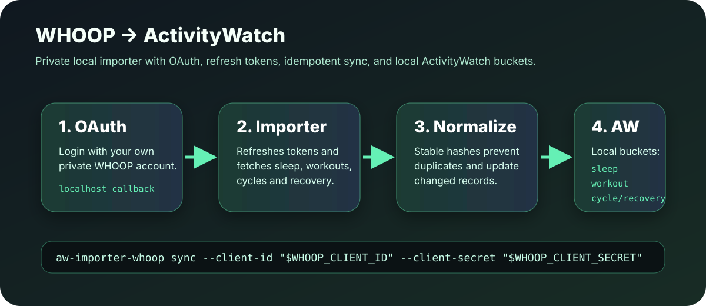

# aw-importer-whoop



Local **WHOOP → ActivityWatch** importer. It connects your own WHOOP account through OAuth, calls the official WHOOP Developer API, and writes normalized events into your local ActivityWatch server.

- ✅ Private by default: tokens stay on your machine.
- ✅ Works with ActivityWatch at `http://127.0.0.1:5600/api/0`.
- ✅ Imports sleep, workouts, cycles, and recovery.
- ✅ Refreshes expiring access tokens automatically.
- ✅ Idempotent sync: changed WHOOP records replace their older ActivityWatch event.
- ✅ Useful for humans and AI agents that need local health/activity context.

## What gets imported

- `aw-importer-whoop-sleep` → `whoop.sleep`
- `aw-importer-whoop-workout` → `whoop.workout`
- `aw-importer-whoop-cycle` → `whoop.cycle`
- `aw-importer-whoop-recovery` → `whoop.recovery`

Each ActivityWatch event contains:

- WHOOP record id
- data type
- normalized public metrics such as timestamps, score state, strain, heart-rate fields when WHOOP provides them
- no raw payload by default

## Requirements

- Python 3.11+
- ActivityWatch running locally
- A WHOOP Developer app
- Your WHOOP account credentials for the browser OAuth consent flow

Check ActivityWatch:

```bash
curl http://127.0.0.1:5600/api/0/info
```

## Install for local development

```bash
git clone https://github.com/<your-user>/aw-importer-whoop.git
cd aw-importer-whoop
python3 -m venv .venv
. .venv/bin/activate
pip install -e '.[dev]'
pytest -q
```

## Configure WHOOP Developer Portal

Open <https://developer-dashboard.whoop.com> and create an app.

Use one redirect URL that exactly matches the local login command. Examples:

- Default:
  `http://127.0.0.1:8765/callback`
- If another app already uses port `8765`:
  `http://localhost:7321/callback`

Required scopes:

```text
offline read:recovery read:cycles read:sleep read:workout read:profile
```

Notes:

- `offline` is required so WHOOP returns a refresh token.
- The redirect URL must match exactly, including hostname and port.
- If you use `localhost:7321` in the portal, use `--redirect-uri http://localhost:7321/callback` locally.
- If you use `127.0.0.1:8765` in the portal, use that exact URI locally.

## OAuth login

Set credentials without committing them:

```bash
export WHOOP_CLIENT_ID='your-client-id'
export WHOOP_CLIENT_SECRET='your-client-secret'
```

Run login:

```bash
aw-importer-whoop login \
  --client-id "$WHOOP_CLIENT_ID" \
  --client-secret "$WHOOP_CLIENT_SECRET" \
  --redirect-uri 'http://localhost:7321/callback'
```

The CLI will:

- start a local callback server
- print and open a WHOOP authorization URL
- wait while you log in with your private WHOOP account
- save tokens to:
  `~/Library/Application Support/aw-importer-whoop/tokens.json`

The browser success page says:

```text
WHOOP authorization complete. You can close this tab.
```

## One-shot sync

```bash
aw-importer-whoop sync --once \
  --client-id "$WHOOP_CLIENT_ID" \
  --client-secret "$WHOOP_CLIENT_SECRET"
```

Expected success log looks like:

```text
tick=<id> fetched=<n> inserted=<n> updated=<n> skipped=<n> next_in=0s
```

## Continuous sync

```bash
aw-importer-whoop sync \
  --client-id "$WHOOP_CLIENT_ID" \
  --client-secret "$WHOOP_CLIENT_SECRET" \
  --interval 900
```

Default interval is 900 seconds / 15 minutes.

## Verify in ActivityWatch

List WHOOP buckets:

```bash
python3 - <<'PY'
import json, urllib.request
buckets = json.load(urllib.request.urlopen('http://127.0.0.1:5600/api/0/buckets/'))
for bucket_id, meta in sorted(buckets.items()):
    if bucket_id.startswith('aw-importer-whoop'):
        print(bucket_id, meta.get('type'), meta.get('created'))
PY
```

Sample expected buckets:

```text
aw-importer-whoop-cycle whoop.cycle
aw-importer-whoop-recovery whoop.recovery
aw-importer-whoop-sleep whoop.sleep
aw-importer-whoop-workout whoop.workout
```

Count events:

```bash
python3 - <<'PY'
import json, urllib.request
base = 'http://127.0.0.1:5600/api/0'
for bucket_id in [
    'aw-importer-whoop-sleep',
    'aw-importer-whoop-workout',
    'aw-importer-whoop-cycle',
    'aw-importer-whoop-recovery',
]:
    events = json.load(urllib.request.urlopen(f'{base}/buckets/{bucket_id}/events'))
    print(bucket_id, len(events))
PY
```

## macOS launchd service

Example plist:

```text
contrib/launchd/ai.servas.aw-importer-whoop.plist
```

Before installing it:

- replace the binary path with your actual venv path or installed binary
- inject credentials through a safe local mechanism
- never commit real secrets

Suggested safer pattern:

- store credentials in macOS Keychain
- wrap the launchd command in a small local script that reads Keychain
- keep that script outside git or make it template-only

## For AI agents

An AI agent can operate this importer safely if it follows these rules:

- Never print or commit `WHOOP_CLIENT_SECRET`, access tokens, or refresh tokens.
- Check callback port availability before login:

```bash
lsof -nP -iTCP:7321 -sTCP:LISTEN
```

- Start `aw-importer-whoop login` before opening the OAuth URL.
- Wait for the browser success page.
- Verify `tokens.json` exists without displaying its contents.
- Run `sync --once` and inspect ActivityWatch bucket counts.
- Only publish after a secret scan.

## Security

Do not commit:

- `.env`
- `.env.*`
- `tokens.json`
- `state.json`
- copied Client Secrets
- terminal logs containing OAuth URLs with temporary authorization codes

The project `.gitignore` excludes common local secrets and virtualenv files.

## Development

```bash
pytest -q
ruff check .
```

## License

Choose and add a license before wider public release.
