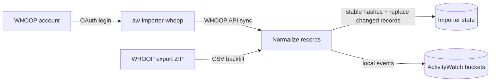

# aw-importer-whoop

Import your own WHOOP data into local ActivityWatch.

## What it supports

- OAuth sync from the WHOOP API into ActivityWatch:
  - sleep
  - workout
  - cycle
  - recovery
- Backfill from WHOOP email export ZIPs:
  - `sleeps.csv`
  - `workouts.csv`
  - `physiological_cycles.csv`
  - `journal_entries.csv`
- Idempotent imports using stable hashes in the local importer state.
- Local-only ActivityWatch buckets prefixed with `aw-importer-whoop-*`.
- Privacy-conscious journal import: journal note text is not written to ActivityWatch.

## Requirements

- Python 3.11+
- Local ActivityWatch server. The package API base defaults to `http://127.0.0.1:5600/api/0`.
- For API sync: WHOOP OAuth client credentials.

## Install

```bash
python -m pip install -e .
```

For development:

```bash
python -m pip install -e . pytest ruff
pytest -q
ruff check .
```

## Configuration

- `WHOOP_CLIENT_ID` — WHOOP OAuth client id.
- `WHOOP_CLIENT_SECRET` — WHOOP OAuth client secret.
- ActivityWatch API base URL defaults to `http://127.0.0.1:5600/api/0` in the package config.
- OAuth tokens and importer state are stored as `tokens.json` and `state.json` under the `platformdirs` user config directory for `aw-importer-whoop`.

## Commands

```bash
# Complete local WHOOP OAuth and save tokens
WHOOP_CLIENT_ID="..." WHOOP_CLIENT_SECRET="..." aw-importer-whoop login

# One-shot API sync
WHOOP_CLIENT_ID="..." WHOOP_CLIENT_SECRET="..." aw-importer-whoop sync --once

# Sync only selected WHOOP API data types
WHOOP_CLIENT_ID="..." WHOOP_CLIENT_SECRET="..." \
  aw-importer-whoop sync --once --type sleep --type recovery

# Continuous API sync every 15 min by default
WHOOP_CLIENT_ID="..." WHOOP_CLIENT_SECRET="..." aw-importer-whoop sync

# Continuous API sync with a custom interval in seconds
WHOOP_CLIENT_ID="..." WHOOP_CLIENT_SECRET="..." aw-importer-whoop sync --interval 900

# Import a WHOOP export ZIP or gzip-wrapped ZIP into ActivityWatch
aw-importer-whoop import-export ~/Downloads/my_whoop_data_YYYY_MM_DD.zip

# Parse a ZIP without writing ActivityWatch events or importer state
aw-importer-whoop import-export ~/Downloads/my_whoop_data_YYYY_MM_DD.zip --dry-run

# Import only selected export CSV types
aw-importer-whoop import-export ~/Downloads/my_whoop_data_YYYY_MM_DD.zip --type sleep --type journal

# Backfill flattened/queryable fields into existing ActivityWatch WHOOP events
aw-importer-whoop repair-existing --days 365

# Preview the repair without writing ActivityWatch events
aw-importer-whoop repair-existing --days 365 --dry-run
```

## Data flow



The SVG version is in `docs/assets/whoop-activitywatch-flow.svg`.

## ActivityWatch buckets

- `aw-importer-whoop-sleep`
- `aw-importer-whoop-workout`
- `aw-importer-whoop-cycle`
- `aw-importer-whoop-recovery`
- `aw-importer-whoop-journal` for export CSV journal answers.

## ActivityWatch event data

Each event keeps the normalized WHOOP record under `record`, and also writes the most useful fields at top level so ActivityWatch queries, exports, and timelines do not need to understand nested WHOOP API shapes.

Common top-level fields:

- `whoop_schema_version`, `whoop_id`, `data_type`
- `start`, `end`, `duration_seconds`, `duration_minutes`, `duration_hours`
- `score_state`, `created_at`, `updated_at`, `timezone_offset`

Cycle/workout strain fields:

- `strain`
- `kilojoule` and `energy_kilojoule`
- `average_heart_rate` and `average_heart_rate_bpm`
- `max_heart_rate` and `max_heart_rate_bpm`

Recovery fields:

- `recovery_score` and `recovery_score_percent`
- `resting_heart_rate` and `resting_heart_rate_bpm`
- `hrv_rmssd_milli` and `heart_rate_variability_ms`
- `spo2_percentage` and `blood_oxygen_percent`
- `skin_temp_celsius`

Sleep/export fields include sleep performance, respiratory rate, sleep-stage minutes, activity names, journal question slugs, and the same raw-safe normalized `record`.

## OpenClaw skill

Agents working in this repository should start with:

```text
AGENTS.md
skills/aw-importer-whoop/SKILL.md
```

The repo-local skill is the canonical agent runbook for OAuth setup, export ZIP backfills, ActivityWatch verification, and repository maintenance.

The OpenClaw skill lives at:

```text
/Users/mh/.openclaw/workspace/skills/whoop-activitywatch-import/SKILL.md
```

The skill helper can find the latest WHOOP export email in `a.m@hausleitner.eu`, download the signed ZIP, and import it into ActivityWatch:

```bash
python3 /Users/mh/.openclaw/workspace/skills/whoop-activitywatch-import/scripts/import_latest_whoop_export.py
```

## Privacy notes

- WHOOP export URLs are signed private links; do not publish them.
- Do not search email, open signed export links, or download a WHOOP export without explicit approval for that run.
- Journal note text is not imported into ActivityWatch; only whether notes exist is retained.
- Keep OAuth credentials out of process arguments when running as a background service; prefer environment variables or a service environment file.
