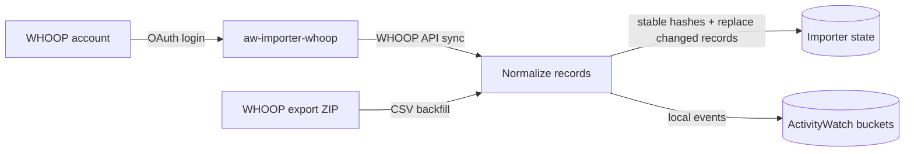

# aw-importer-whoop

Import your own WHOOP data into local ActivityWatch.

## What it supports

- OAuth sync from the WHOOP API into ActivityWatch:
  - sleep
  - workout
  - cycle
  - recovery
- Backfill from WHOOP email export ZIPs:
  - `sleeps.csv`
  - `workouts.csv`
  - `physiological_cycles.csv`
  - `journal_entries.csv`
- Idempotent imports using stable hashes in the local importer state.
- Local-only ActivityWatch buckets prefixed with `aw-importer-whoop-*`.
- Privacy-conscious journal import: journal note text is not written to ActivityWatch.

## Requirements

- Python 3.11+
- Local ActivityWatch server, default: `http://localhost:5600`
- For API sync: WHOOP OAuth client credentials.

## Install

```bash
python -m pip install -e .
```

For development:

```bash
python -m pip install -e . pytest ruff
pytest -q
ruff check .
```

## Configuration

- `WHOOP_CLIENT_ID` — WHOOP OAuth client id.
- `WHOOP_CLIENT_SECRET` — WHOOP OAuth client secret.
- ActivityWatch base URL defaults to `http://localhost:5600` in the package config.
- OAuth tokens and importer state are stored in user data/config paths via `platformdirs`.

## Commands

```bash
# Complete local WHOOP OAuth and save tokens
aw-importer-whoop login \
  --client-id "$WHOOP_CLIENT_ID" \
  --client-secret "$WHOOP_CLIENT_SECRET"

# One-shot API sync
aw-importer-whoop sync --once \
  --client-id "$WHOOP_CLIENT_ID" \
  --client-secret "$WHOOP_CLIENT_SECRET"

# Sync only selected WHOOP API data types
aw-importer-whoop sync --once --type sleep --type recovery \
  --client-id "$WHOOP_CLIENT_ID" \
  --client-secret "$WHOOP_CLIENT_SECRET"

# Continuous API sync every 15 min by default
aw-importer-whoop sync \
  --client-id "$WHOOP_CLIENT_ID" \
  --client-secret "$WHOOP_CLIENT_SECRET"

# Continuous API sync with a custom interval in seconds
aw-importer-whoop sync --interval 900 \
  --client-id "$WHOOP_CLIENT_ID" \
  --client-secret "$WHOOP_CLIENT_SECRET"

# Import a WHOOP export ZIP into ActivityWatch
aw-importer-whoop import-export ~/Downloads/my_whoop_data_YYYY_MM_DD.zip

# Parse a ZIP without writing ActivityWatch events or importer state
aw-importer-whoop import-export ~/Downloads/my_whoop_data_YYYY_MM_DD.zip --dry-run

# Import only selected export CSV types
aw-importer-whoop import-export ~/Downloads/my_whoop_data_YYYY_MM_DD.zip --type sleep --type journal
```

## Data flow



The SVG version is in `docs/assets/whoop-activitywatch-flow.svg`.

## ActivityWatch buckets

- `aw-importer-whoop-sleep`
- `aw-importer-whoop-workout`
- `aw-importer-whoop-cycle`
- `aw-importer-whoop-recovery`
- `aw-importer-whoop-journal` for export CSV journal answers.

## OpenClaw skill

The OpenClaw skill lives at:

```text
/Users/mh/.openclaw/workspace/skills/whoop-activitywatch-import/SKILL.md
```

The skill helper can find the latest WHOOP export email in `a.m@hausleitner.eu`, download the signed ZIP, and import it into ActivityWatch:

```bash
python3 /Users/mh/.openclaw/workspace/skills/whoop-activitywatch-import/scripts/import_latest_whoop_export.py
```

## Privacy notes

- WHOOP export URLs are signed private links; do not publish them.
- Journal note text is not imported into ActivityWatch; only whether notes exist is retained.
- Keep OAuth credentials out of process arguments when running as a background service; prefer environment variables or a service environment file.
